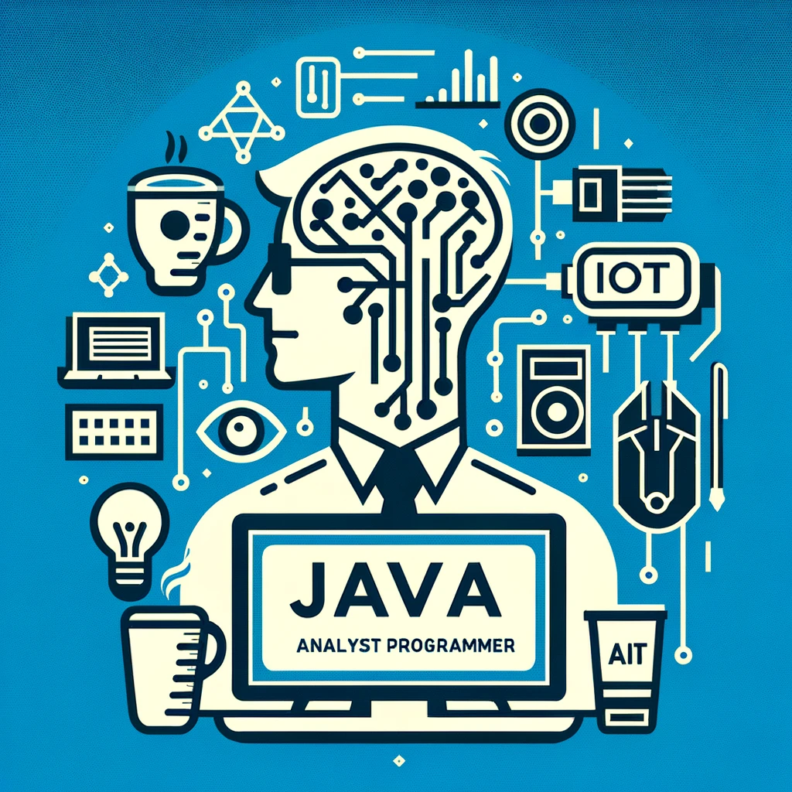

# Rafael Costa Biasi

### Analista Programador Java Sênior
### Especialista em Desenvolvimento Backend

---

:envelope: **E-mail:** [rafael.biasi+resume@gmail.com](mailto:rafael.biasi+resume@gmail.com)  
:link: [**LinkedIn**](https://www.linkedin.com/in/rafael-biasi-82ba0912/)  
:scroll: [Currículo completo](Curriculum.md)

---

## :pushpin: Sobre Mim

Profissional com mais de 16 anos de experiência em desenvolvimento de software, especializado em Java e tecnologias de backend. Habilidade comprovada em liderar e contribuir para projetos de software complexos, aplicando metodologias ágeis e inovando em soluções. Proficiente em diversas tecnologias e frameworks, sempre buscando eficiência, escalabilidade e segurança em projetos.

---

## :dart: Objetivo

Viso aplicar minhas habilidades avançadas em programação Java e minha vasta experiência em arquitetura de software para enfrentar desafios significativos na área de desenvolvimento backend.

---

## :books: Educação e Certificações

- **Tecnólogo em Comunicação Digital Web Design,** Universidade Paulista (UNIP), 2004
- **Academia do Java,** Globalcode, 2006
- **Sun Certified Java Programmer (SCJP/OCJP) 5.0,** 2008
- **Academia do Arquiteto,** Globalcode, 2012

---

## :computer: Experiência Profissional

### Autodesenvolvimento | Jan/2023 - Atual
Foco em autodesenvolvimento, explorando novas tecnologias e projetos pessoais. Aprimoramento em Eletrônica Básica, Impressão 3D, Gravação/Corte a Laser, além de ferramentas de IA e IoT.

### **Keyrus Brasil** | Analista Desenvolvedor Java | Mar/2018 - Jan/2023
Desenvolvimento em projetos de E-commerce para grandes varejistas, utilizando SAP Commerce / Hybris. Liderança técnica parcial e otimização de processos.

### **Flexvision Serviços LTDA** | Analista Desenvolvedor Java | Dez/2016 - Mar/2018
Desenvolvimento e manutenção de sistemas de monitoramento de rede e arquitetura de sistemas de integração.

### **Spread Tecnologia** | Desenvolvedor de Sistema | Set/2012 - Mar/2016
Desenvolvimento e integração de sistemas de logística para a Petrobras, utilizando Java e tecnologias relacionadas.

### **Freeddom Tecnologia** | Analista de Sistemas | Ago/2008 - Ago/2012
Desenvolvimento e manutenção de sistemas de gestão de pagamentos mobile, com foco em integração e modularização.

---

## :hammer_and_wrench: Habilidades Técnicas

- **Linguagens de Programação:** Java (até a versão 17), Kotlin, Groovy, Scala
- **Frameworks:** Spring, Hibernate, Mockito, Junit
- **Bancos de Dados:** MySQL, Oracle Database
- **Ferramentas de Desenvolvimento:** Maven, Git, IntelliJ IDEA, Eclipse
- **Web Technologies:** REST, JavaScript, NodeJS, HTML5, CSS
- **Ferramentas de IA:** ChatGPT, Copilot
- **Outros:** IoT, Arduino, Raspberry Pi, Eletrônica Básica, Impressão 3D, Gravação/Corte a Laser

---

## :seedling: Aprendizado Contínuo

Comprometido com o autodesenvolvimento contínuo, estou sempre explorando novas tecnologias e metodologias para aprimorar minhas habilidades e contribuir de maneira significativa para os projetos em que estou envolvido.

---

## :telephone_receiver: Contato

Para discussões profissionais, projetos colaborativos ou oportunidades, sinta-se à vontade para entrar em contato através do [e-mail](mailto:rafael.biasi+resume@gmail.com) ou conectar-se no [LinkedIn](https://www.linkedin.com/in/rafael-biasi-82ba0912/).

